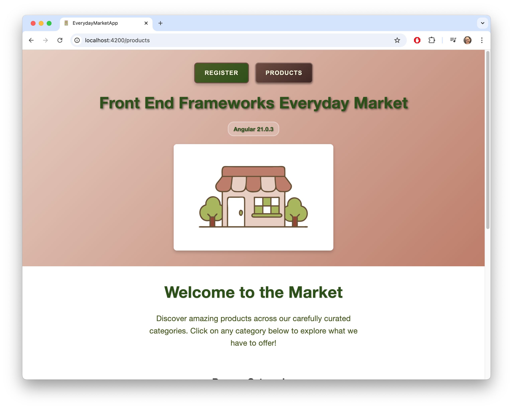

# Assignment 3 - Everyday Market App (Angular Routing)

**Student:** Joanne  
**Course:** Front End Frameworks (T0511)  
**Weight:** 25%

## Overview
Extends Assignment 1 with Angular routing and a registration form. Demonstrates navigation and form validation.

## Screenshots

### Products Page

Main products browsing page with category filtering and navigation

### Registration Form

Registration form with validation

## Features
- Angular routing between Products and Register pages
- Reactive form validation (custom validators)
- Category browsing (Grocery, Clothing, Stationary)
- Responsive design

## Getting Started
```bash
cd assignment3/everyday-market-app
npm install
npx ng serve --port 4201
# Open http://localhost:4201
```

### Project Structure
```
src/
├── app/
│   ├── shared/           # Reusable components (Header, Footer, RegisterPage)
│   ├── market/           # Market feature module (ProductsPage, CategoryMenu)
│   ├── validators/       # Custom form validators
│   └── app.routes.ts     # Routing configuration
├── main.ts              # Application bootstrap
└── styles.css           # Global styles
```

## Learning Outcomes Demonstrated

**Angular Framework Knowledge**: Routing, forms, and modern v17+ features  
**Component Creation**: CLI for scaffolding components  
**Reusable Components**: Standalone component organization  
**Data Binding**: Property and event binding  
**Component Communication**: @Input(), @Output(), EventEmitter  
**Modern Control Flow**: @for syntax, custom validators

## Testing & Linting

- Run tests: `ng test`
- Lint code: `ng lint`
- Manual testing: Interact with the app in your browser to verify navigation, registration form validation, and responsive layout.

## AI Usage Disclosure

AI assistance was used for:
- **Debugging**: Troubleshooting component import issues
- **Styling Ideas**: Responsive layout and modern Angular patterns
- **Code Review**: Ensuring best practices and Angular idioms
- **Documentation**: Structuring code comments and README content

All code implementation and architectural decisions were made independently with full understanding of the functionality.

## References

- [Angular Documentation](https://angular.dev/) - Official Angular 17+ documentation
- [Angular CLI Guide](https://angular.dev/tools/cli) - Command line interface reference
- [Component Interaction](https://angular.dev/guide/components/communication) - @Input/@Output patterns
